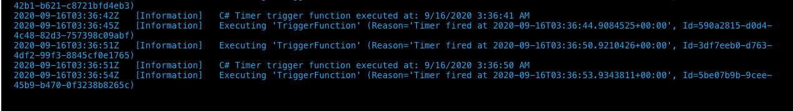
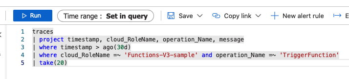
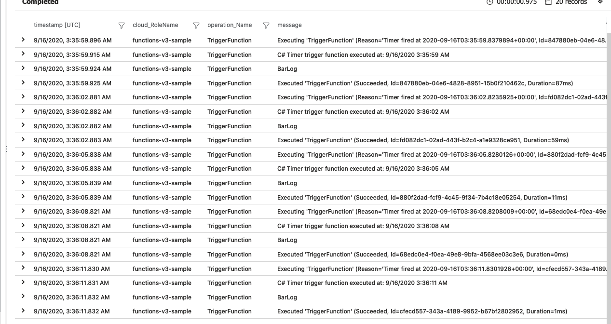

# AF-1681-Repro
An attempt to repro the issue [here](https://github.com/Azure/Azure-Functions/issues/1681)

## Results
Changed the namespace of the requisite classes and examined logging.

Interactive log shows:

Querying AppInsights with the following query Shows

